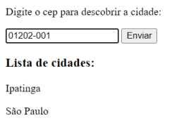
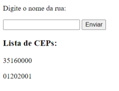
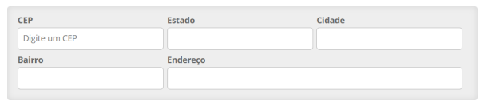
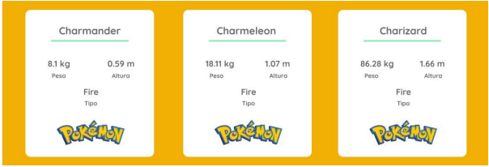
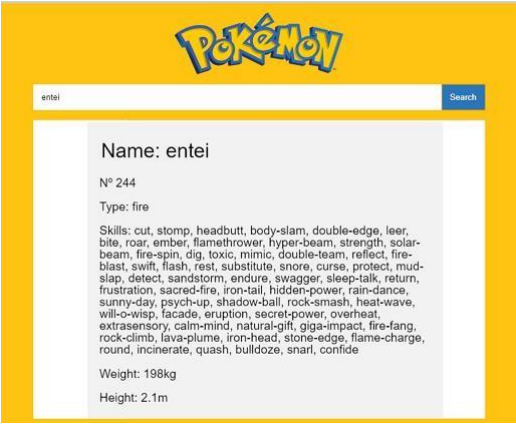

# Exercícios: Fetch

1 - Crie uma lista de nomes de cidade através do uso da API ViaCep. O usuário deverá
digitar o CEP e o algoritmo retornar o nome da cidade correspondente, como no exemplo
abaixo:

2 - Crie uma lista de CEP através do uso da API ViaCep. O usuário deverá digitar o
endereço e o algoritmo retornar o número do CEP correspondente, como no exemplo
abaixo:

3 - Utilize a API pública ViaCep para para completar os dados do cadastro a partir da
inserção do cep. Crie um formulário similar ao exemplo abaixo:

4 - Crie uma lista de pokemons utilizando a API pública PokeAPi. Baseie-se no exemplo
abaixo:

5 - Utilize a API pública PokeAPi para criar uma aplicação que recebe o nome de um pokemon
e retorna algumas informações sobre o mesmo. Baseie-se no exemplo abaixo:

6 - Crie uma aplicação usando a API pública Makeup API, onde o usuário entrará com um
produto, marca e preço, e a aplicação retornará uma lista de produtos.